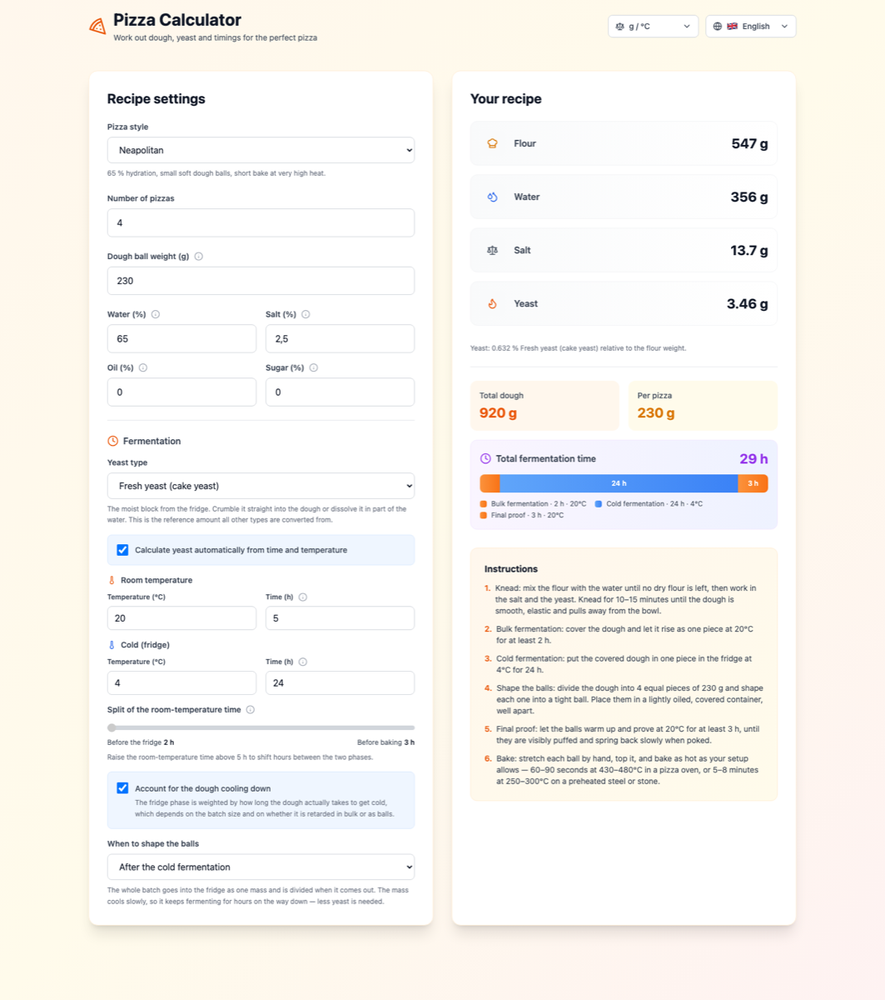

<div align="center">

# 🍕 pizza-calc

### Dough, yeast and timings for the pizza you actually have time to make

Most dough calculators ask how much yeast you want to use.<br>
This one asks **when you want to eat** — and works the yeast out from there.

[](https://github.com/moma03/pizza-calc/actions/workflows/deploy.yml)


[](LICENSE)



</div>

---

## What it does

Tell it how many pizzas, how warm your kitchen is, and how long the dough can sit
in the fridge. It gives you the flour, water, salt and yeast in grams, a timeline
of the whole ferment, and step-by-step instructions with your own times written
into them.

| | |
|---|---|
| 🧮 **Baker's percentages** | Any batch size and ball weight, with optional oil and sugar |
| 🌡️ **Yeast from the schedule** | Derived from time *and* temperature, for fresh, instant or active dry yeast |
| ❄️ **Cooling correction** | Batch size and bulk-vs-ball retarding feed into the yeast figure — [see below](#-the-fermentation-model) |
| 🍕 **Style presets** | Neapolitan, New York and Roman, plus a free-form mode |
| 🧪 **Four dough methods** | Direct, poolish, biga and sourdough — preferment and starter amounts, timings and feeding worked out too ([research and calibration](docs/preferments.md)) |
| ❄️ **Cold and long preferments** | Fridge poolish, cold biga and the 48 h biga as variants, or any mix of room and fridge hours with sliders, and one-click shares from 20 to 100 % |
| 🗓️ **Bake-time planner** | Enter when you want to bake and every step gets its clock time — a 72 h biga pizza included |
| ⏱️ **Your own timings** | A slider splits the room-temperature time either side of the fridge |
| 🌍 **Bilingual** | German and English, each on its own URL — metric and imperial, everything converts |
| 🔎 **Prerendered** | Every page ships as static HTML with its text, a worked recipe, structured data and `hreflang` — see [below](#-search-engines) |
| 🧊 **Ice in the mix** | A share of the hydration weighed as ice, adjustable, to keep the dough cool while kneading |
| 🌙 **Dark mode** | Follows the system setting |

---

## 📐 The fermentation model

The interesting part of this project isn't the arithmetic — it's working out how
much yeast a given schedule needs.

> **[docs/](docs/README.md)** — the full write-up, starting with
> **[a diagram of the whole calculation](docs/calculation-pipeline.md)**

It covers:

- **[The model itself](docs/fermentation-model.md#2-the-model-this-app-uses)** — a
  power law for the room-temperature phase, a saturating Hill curve for the cold
  one, and the tabulated factor that joins them
- **[Standard formulas](docs/fermentation-model.md#3-standard-formulas-for-cross-checking)** —
  Arrhenius, Q10 / van 't Hoff, the reference-point method, and desired dough
  temperature, with the arithmetic spelled out
- **[A cross-check](docs/fermentation-model.md#4-how-the-two-compare)** — this app
  against a plain Q10 model across seven schedules
- **[Does the order matter?](docs/fermentation-model.md#6-does-it-matter-where-the-warm-time-happens)** —
  why the theory says no, why thermal lag says yes, and why the popular
  explanation (yeast multiplying in the dough) turns out to be wrong
- **[Preferments](docs/preferments.md)** — biga, poolish and sourdough as the
  sources make them, and how each was calibrated onto the model, cold and long
  variants included

Short version: dough takes **hours** to reach fridge temperature, and a single
mass cools far slower than divided balls — so *when* you shape them changes how
much fermentation you bank on the way down. That correction is switchable; turn
it off and you get the plain wall-clock estimate.

Treat all of it as a starting point. Flour strength, actual fridge temperature
and yeast freshness all move the target, and none of them are inputs here.
**Judge the dough, not the clock.**

---

## Quick start

```bash
npm install
npm run dev
```

| script | what it does |
|---|---|
| `npm run dev` | dev server on :5173 |
| `npm run build` | production build into `dist/`, prerendered per page |
| `npm run typecheck` | `tsc`, including the translation completeness check |
| `npm run lint` | eslint |

### Translations are type-checked

`src/i18n/locales/en.json` is the reference key set, and `de.json` is checked
against it with `satisfies` in [`src/i18n/index.ts`](src/i18n/index.ts). A missing
or misspelt German key **fails `npm run typecheck`** rather than silently falling
back to English.

Each language is its own page: English at `/`, German at `/de/`. The English
page doubles as the `x-default` and forwards first-time visitors whose browser
asks for German; an explicit pick in the language switcher wins over that. Old
`?lng=de` links are 301-redirected to `/de/`.

### Layout

```
src/
├── components/      presentational React components
├── i18n/            i18next setup + en/de locale files
├── routes.ts        one page per language and dough method
├── navigation.ts    language preference and redirects
├── entry-server.tsx build-time render: page HTML, <head>, sitemap
└── lib/
    ├── math.ts      clamping, rounding, interpolation, table lookup
    ├── units.ts     metric ⇄ imperial conversion and formatting
    ├── recipe.ts    input limits, style presets, baker's-percentage maths
    └── fermentation/
                     factor tables, yeast maths, room schedule,
                     cooling-curve correction
docs/
├── README.md               index
├── calculation-pipeline.md diagrams of the calculation
├── fermentation-model.md   the yeast model
└── preferments.md          research and calibration for biga, poolish, sourdough
scripts/
└── prerender.mjs    writes the static pages after `vite build`
```

Everything in `lib/` works in metric base units — grams, °C, hours. Conversion to
whatever unit system is on screen happens only in the components.

---

## 🔎 Search engines

`npm run build` runs Vite twice — the client bundle, then an SSR build of
[`src/entry-server.tsx`](src/entry-server.tsx) — and
[`scripts/prerender.mjs`](scripts/prerender.mjs) renders every route in
[`src/routes.ts`](src/routes.ts) into its own `index.html` (`dist/`,
`dist/de/`). The browser then hydrates that markup instead of starting from an
empty `<div>`, so crawlers get the full page without running JavaScript:

- the calculator with a complete default recipe, plus a guide, a yeast table
  computed by the model, and an FAQ under it
- a localised `<title>`, description, Open Graph tags and `<html lang>`
- `WebApplication` and `FAQPage` structured data
- with `SITE_URL` set: `rel=canonical`, `hreflang` alternates (including
  `x-default`), `og:url`/`og:image`, and a `sitemap.xml` referenced from
  `robots.txt`

```bash
SITE_URL=https://example.com npm run build
```

Every dough method has its own page per language — `/`, `/poolish/`, `/biga/`,
`/sourdough/`, and the same under `/de/` (sourdough as `/de/sauerteig/`) — with its own title, guide, table and
FAQ. Switching method in the form moves to that page's URL without a reload.

---

## Deployment

[`.github/workflows/deploy.yml`](.github/workflows/deploy.yml) builds on every push
to `main` and uploads to IONOS over SFTP with `lftp`.

### 🔁 Re-running an old run is a rollback

Three things make this work:

1. `actions/checkout` pins to `github.sha`, so a re-run rebuilds **that** commit,
   never the current tip of `main`
2. `npm ci` installs strictly from that commit's lockfile
3. the upload runs `lftp mirror --delete --transfer-all`, so the remote directory
   ends up byte-for-byte the build output — every file re-uploaded, anything left
   behind by another deploy removed

So **"Re-run all jobs" on any past run puts the server back into exactly that
run's state.** Use that rather than *Re-run failed jobs*, which reuses the stored
build artifact and expires after 90 days.

`workflow_dispatch` also takes a `dry_run` input that runs the mirror with
`--dry-run`, so you can preview which files would change.

### Apache configuration

The deploy writes an `.htaccess` alongside the build. It sets long-lived
`immutable` caching on Vite's fingerprinted assets, `no-cache` on `index.html`
and `release.json` — without which a stale entry point could survive a rollback
and point at asset files `--delete` has already removed — plus gzip, UTF-8, a
deny rule for `.ht*`, and 301s from the old `?lng=` URLs to the per-language
pages. Every directive is wrapped in an `<IfModule>` guard, so it
degrades safely on a server missing any of them.

The app has no client-side router: every page is a real directory with its own
`index.html`, so no fallback rewrite is needed. The site is
served publicly with no HTTP auth, so search engines can reach it.

> [!WARNING]
> `--delete` removes anything in `REMOTE_PATH` that is not part of the build.
> Point it at a directory this site owns exclusively.

<details>
<summary><b>Configuration</b> — secrets and variables</summary>

<br>

Repository **secrets**:

| name | required | purpose |
| --- | --- | --- |
| `SSH_HOST` | ✅ | IONOS SSH host |
| `SSH_USER` | ✅ | SSH user |
| `SSH_PRIVATE_KEY` | one of | deploy key — preferred |
| `SSH_PASSWORD` | one of | password, used when no key is set |
| `SSH_KNOWN_HOSTS` | — | pinned host key; without it the workflow runs `ssh-keyscan` and warns |

Repository **variables**:

| name | default | purpose |
| --- | --- | --- |
| `REMOTE_PATH` | — | target directory on the server (**required**) |
| `SSH_PORT` | `22` | SSH port |
| `BASE_PATH` | `/` | set to e.g. `/pizza-calc/` when serving from a subdirectory |
| `SITE_URL` | — | your public URL, including `BASE_PATH`. Passed to the build for the sitemap, `rel=canonical`, `hreflang` and Open Graph URLs, and used for an HTTP check after deploying. Set this before submitting to Google |

`REMOTE_PATH` and `SSH_PORT` also fall back to the older `SSH_REMOTE_PATH` and
`SSH_PORT` secrets.

</details>

<details>
<summary><b>Docker</b> — run it as a container instead</summary>

<br>

[`Dockerfile`](Dockerfile) builds the same static output and serves it with nginx:

```bash
docker build -t pizza-calc .
docker run --rm -p 8080:80 pizza-calc
```

</details>

---

## License

[MIT](LICENSE) — code and documentation alike. Do what you like with it; just
keep the copyright notice.

If you use the fermentation model or the write-up in
[docs/fermentation-model.md](docs/fermentation-model.md) somewhere, a link back
is appreciated but not required.
