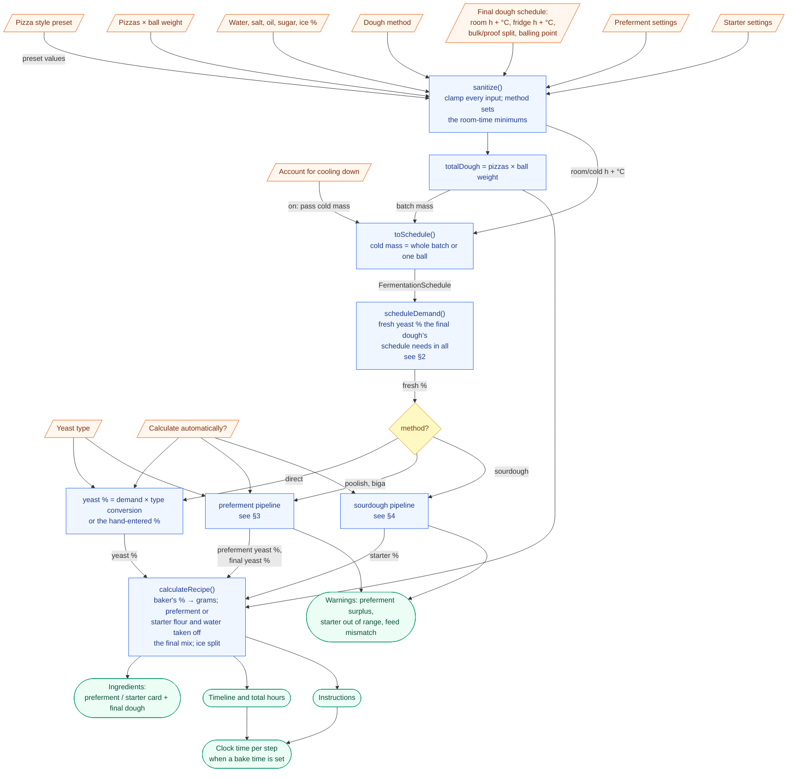
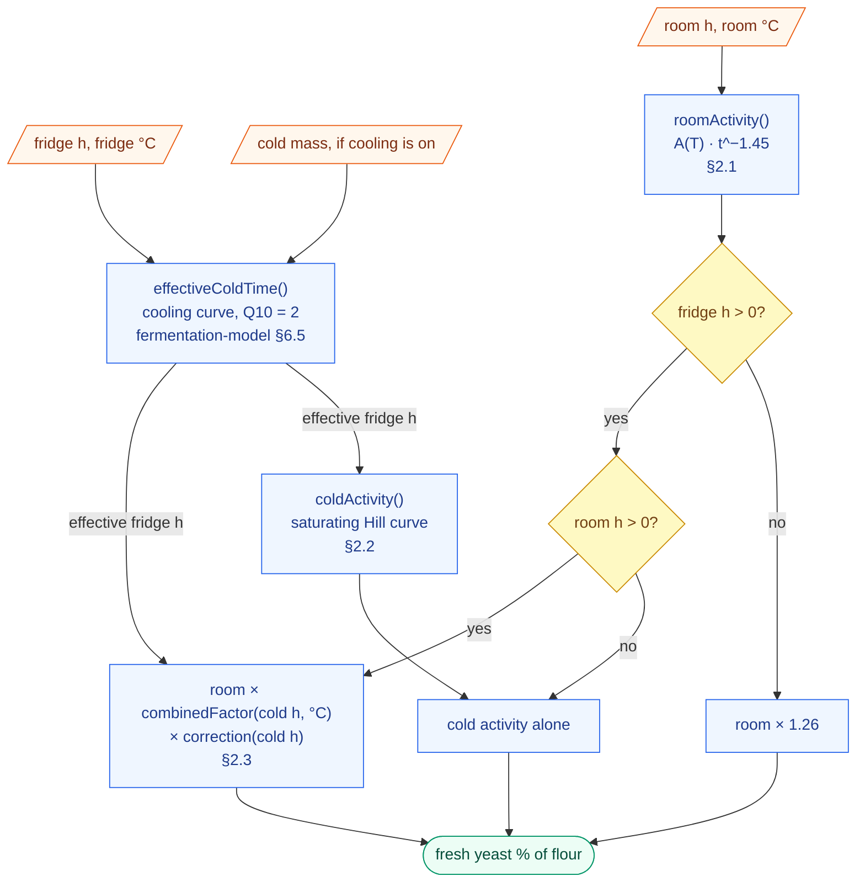
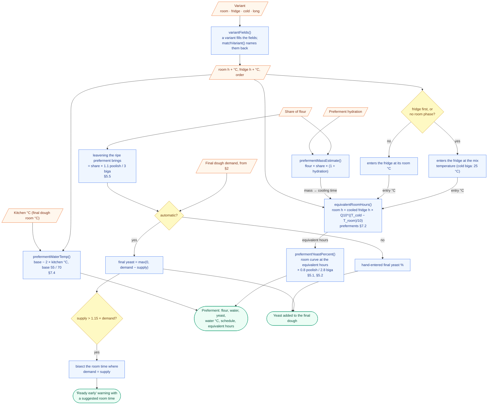
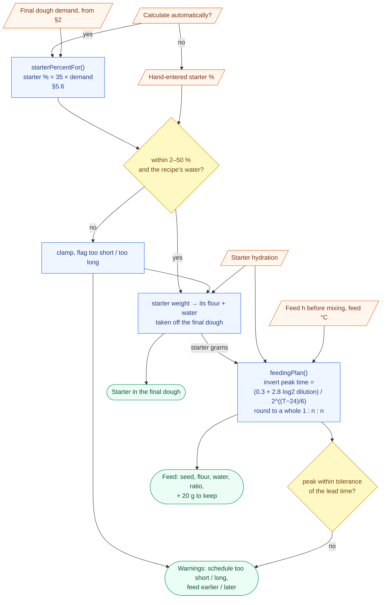

# Calculation pipeline

How a set of inputs becomes a recipe. The diagrams show **settings** as
slanted boxes, **decisions** as diamonds, **calculations** as rectangles and
**results** as rounded boxes. The edges carry the data between them. Every
calculation names the function that does it, and the section of the docs that
explains why it works that way.

All of it runs in [`src/lib/`](../src/lib/), in metric base units (grams, °C,
hours). Conversion to ounces and °F happens only in the components.

---

## 1. Overview

---

## 2. Yeast demand of the final dough

`scheduleDemand()` in [`recipe.ts`](../src/lib/recipe.ts) calls
`freshYeastFraction()` in [`yeast.ts`](../src/lib/fermentation/yeast.ts). This
is the original model, described in
[fermentation-model.md §2](fermentation-model.md#2-the-model-this-app-uses).

---

## 3. Preferment pipeline (poolish, biga)

Implemented in [`methods.ts`](../src/lib/fermentation/methods.ts) and
`resolveYeastPercent()` / `prefermentSurplus()` in
[`recipe.ts`](../src/lib/recipe.ts). The numbers are sourced in
[preferments.md §5 and §7](preferments.md#5-how-this-maps-onto-the-existing-model).

---

## 4. Sourdough pipeline

Implemented in [`sourdough.ts`](../src/lib/fermentation/sourdough.ts) and
`resolveStarterPercent()` in [`recipe.ts`](../src/lib/recipe.ts). Sourced in
[preferments.md §4 and §5.6](preferments.md#56-sourdough-as-implemented).

---

## 5. Timeline and planner

[`RecipeDisplay.tsx`](../src/components/RecipeDisplay.tsx) lays the phases end
to end. In order, they are the preferment's room and fridge phases (in its
chosen order) or the starter feed, then the bulk rise, the fridge, and the
ball proof. With a bake time entered, each step's clock time is the bake time
minus the hours still to go after that step starts. Nothing is stored; the bake
time lives only in the page.
